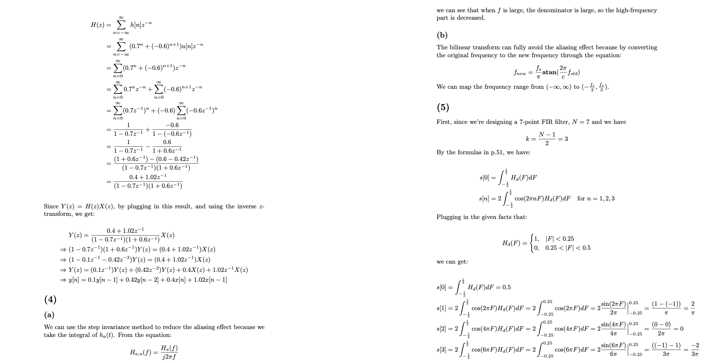

<h1 align="center">
NTU EE: ADSP (2025 Spring)
</h1>

---

> An example screenshot from HW1.

This repository contains the <ins>homework and the lecture notes</ins> when I took the course:

 **"Advanced Digital Signal Processing" (ADSP) @ NTU EE, conducted by professor JJ Ding (Jian-Jiun Ding)**

Details about this repo are explained in the following part.

If you found anything wrong or needed to be clarified, feel free to leave a message in the "issues" field!
Hope that this repo could help you with the course :wink:

# Contents of this repo

This repository contains:
- Homework files: Under subdirectory with prefix `HW`
- Lecture notes (ppt given by the instructor along with my notes): Under subdirectory `Lecture_notes`

## HW

For the homework part, you can find a readme file (named `HW*_README.md`) under each `HW` subdirectory, which contains information about:

- each file's usage
- score of this assignment
- feedback (correct solutions given by the TAs)

:warning: **IMPORTANT**: I really recommend reading these readme files (`HW*_readme.md`) since <ins>some files might be wrong, and are not included in the final handed in version, and some of my solutions also include errors!</ins>

## Lecture notes

In the `Lecture_notes` subdirectory, some pdf files are contained, they are the lecture ppts (version with written notes) given by the professor, with my own notes added.

However, you may find that my handwritings are hard to read :cry:  
I knew that so <ins>I changed into typing for most of the notes after p.121 of `ADSP_Write2`</ins>, so if you are frustrated recognizing the contents of my notes, you can start reading from here! 

- I do not have time to finish all the lecture videos for the last few weeks of the semester, so there's no notes for `ADSP_write5`, `ADSP_write6`, `ADSP_write7` :smiling_face_with_tear:

### Two versions of ADSP_Write2.pdf

Note that for the file `ADSP_Write2.pdf`, there's two similar files:

- `ADSP_Write2.pdf`: p.81-151
- `ADSP_Write2_updated_version.pdf`: p.81-180

This is because originally I downloaded the older version of ADSP_Write2, so it only contains content from p.81 to p.151, and the newer version extends the content to p.180.

However, the notes for p.81-151 are already written in `ADSP_Write2.pdf`, so: 

$\rightarrow$ check `ADSP_Write2.pdf` if you need the notes for p.81-151   
$\rightarrow$ check `ADSP_Write2_updated_version.pdf` if you need the notes for p.152-180

### Two versions of ADSP_Write3.pdf

Similar to `ADSP_Write2.pdf`, I first wrote notes on the older version of lecture slides `ADSP_Write3.pdf`, which only contains pages p.181-195, so:

$\rightarrow$ check `ADSP_Write3.pdf` if you need the notes for p.181-195 
$\rightarrow$ check `ADSP_Write3_updated_version.pdf` if you need the notes for p.196-273

